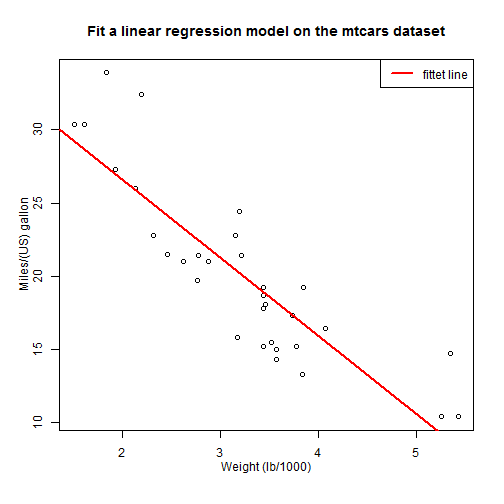
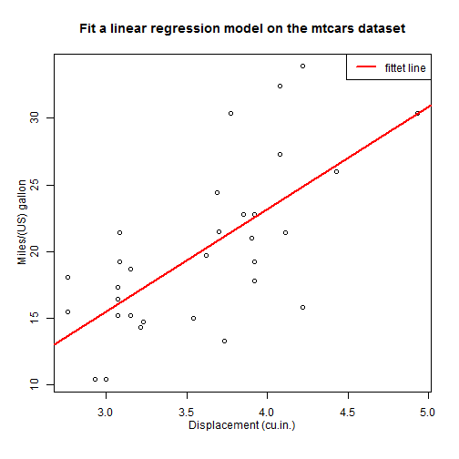

## Introduction

1. In this Shiney application, we focus on the 'mtcars' dataset.
2. You will learn to fit a linear regression model. 
$y = a + b*x$
3. The predictor (i.e. $x$) can be chosen from 'wt', 'drat' and 'qsec'.
4. The outcome (i.e. $y$) can only be 'mpg' which means the Miles/(US) gallon.
5. Use an empty line followed by three dashes to separate slides!


```
##       mpg             wt            drat           qsec     
##  Min.   :10.4   Min.   :1.51   Min.   :2.76   Min.   :14.5  
##  1st Qu.:15.4   1st Qu.:2.58   1st Qu.:3.08   1st Qu.:16.9  
##  Median :19.2   Median :3.33   Median :3.69   Median :17.7  
##  Mean   :20.1   Mean   :3.22   Mean   :3.60   Mean   :17.8  
##  3rd Qu.:22.8   3rd Qu.:3.61   3rd Qu.:3.92   3rd Qu.:18.9  
##  Max.   :33.9   Max.   :5.42   Max.   :4.93   Max.   :22.9
```

--- .class #id 

## mpg ~ wt

- You can choose 'wt' as the predictor of linear regression model.
- After you choose the predictor and the outcome, please click the following button 'Fit'. 

 

--- .class #id 

## mpg ~ drat
- You can choose 'drat' as the predictor of linear regression model.
- After you choose the predictor and the outcome, please click the following button 'Fit'. 

 

--- .class #id 

## mpg ~ qsec
- You can choose 'qsec' as the predictor of linear regression model.
- After you choose the predictor and the outcome, please click the following button 'Fit'. 

 


